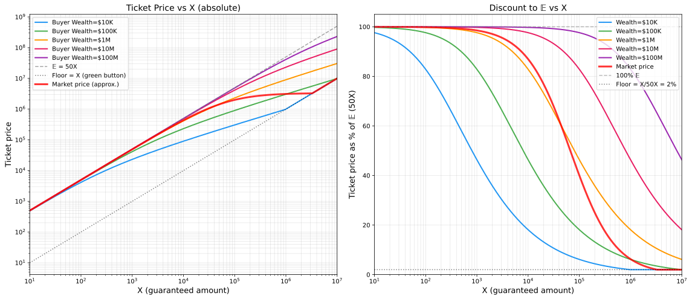
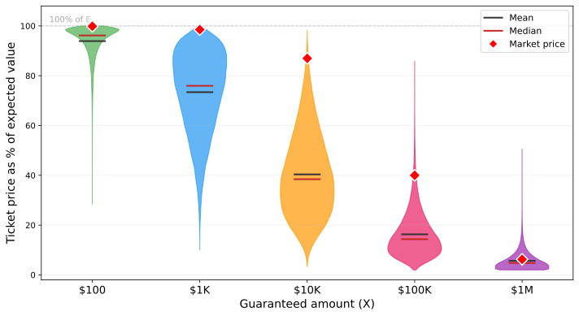

# Gut vs Expected Value

Imagine two buttons in front of you.

| | |
|---|---|
| **Red** | 50% chance to win **$100X** |
| **Green** | 100% chance to receive **$X** |

You can play yourself or sell the ticket. The question is: **for how much?**

The expected value of the red button is **E = 50X**, which is 50 times the green one. Sounds like an easy choice. But plug in real numbers: X = $1,000,000. Would you really walk away from a guaranteed million for a coin flip on a hundred million?

Most people wouldn't. And they're not being irrational.

## Why the price depends on who's buying

Every next dollar brings a little less joy than the previous one. A million to a student is a life-changing event. A million to a billionaire is a rounding error. This is called **diminishing marginal utility**, and it's the reason people are cautious with large bets.

With logarithmic utility (a classical model that fits real behavior reasonably well), the "fair price" of the red button for someone with wealth *W* is:

> **Certainty Equivalent = sqrt(W * (W + 100X)) - W**

The ticket price is **max(CE, X)**, because the green button sets the floor.

*Left: absolute ticket price by buyer wealth (log scale). Right: ticket price as percentage of E[X]. Red line: approximate market price.*

## Who pays what

| Buyer's Wealth | Ticket Price | Share of E |
|---|---|---|
| 100X | ≈ 41X | 82% |
| 10X | ≈ 23X | 46% |
| X | ≈ 9X | 18% |
| 0.1X | ≈ 2.2X | 4.4% |

The pattern is simple: the smaller the bet relative to your net worth, the closer you get to the "rational" 50X. The larger it is, the more you want to press green.

## What happens on a real market

In a market with many participants, the price isn't set by the average buyer. It's set by **the most risk-tolerant one**, the person for whom the stakes feel small. A rough approximation:

> **Price ≈ 50X / (1 + 1.5 * X / Wealth_median)**

When X is small, the price approaches 50X. When X is large, it collapses toward X.

## What experiments tell us

Kahneman and Tversky showed that real people deviate from the logarithmic model in a predictable way. The guaranteed X you have to give up doesn't feel like a missed opportunity. It feels like a **loss**. And losses hurt roughly twice as much as equivalent gains, which pushes the price down even further.

For calibration: a typical person behaves with a risk aversion coefficient γ ≈ 1–2. Financial professionals sit around γ ≈ 0.5–1. Some people hit γ ≈ 3–5, and for them even a modest red button looks terrifying.

*Distribution of "fair" ticket prices (as % of E) across a simulated population (log-normal wealth, median $60K). The wider the shape, the more people cluster at that price. Red diamond: approximate market clearing price. The bigger the game, the steeper the discount.*

## Build

Requires [uv](https://docs.astral.sh/uv/) and [typst](https://typst.app/).

| Command | What it does |
|---|---|
| `make` / `make all` | Generate SVG plots and compile PDF |
| `make svg` | Generate SVG plots only |
| `make pdf` | Compile Typst document to PDF |
| `make clean` | Remove all generated files |

Builds are cached — re-running `make` skips targets whose sources haven't changed.
